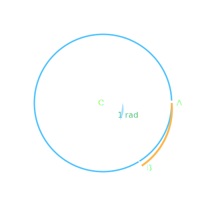

Bir çember 360 eşit parçaya bölündüğünde bu parçalardan her birini gören merkez açının ölçüsüne **1 derece** denir.

Derece " ° " sembolü ile gösterilir.

1° nin $$\frac{1}{60}$$'ına **1 dakika** denir. Dakika " ’ " sembolü ile gösterilir.

1° = 60’ dır.

1’ nın $$\frac{1}{60}$$'ına **saniye** denir. Saniye " “ " sembolü ile gösterilir.

1’ = 60“ dir. Çemberin derece cinsinden ölçüsü 360° dir.

Bir çemberde yarıçap uzunluğundaki bir yayı gören merkez açının ölçüsüne **1 radyan** denir.

Yanda verilen O merkezli çemberde AOB açısının ölçüsü 1 radyandır. Yarıçap uzunluğu r olan bir çemberin çevresi $$2\pi{r}$$'dir. Buna göre doğru orantı kullanılarak:

Yarıçapı r olan bir çemberin çevresinin uzunluğu $$2\pi{r}$$'dir.

1 radyan r uzunluğundaki bir yayı gören merkez açıya karşılık geliyor ise x radyan $$2\pi{r}$$ uzunluğundaki bir yayı gören merkez açıya karşılık gelir.

$$xr=2\pi{r}\rightarrow{x=2\pi}$$ olur. Buradan çemberin çevresi $$2\pi$$ radyan olarak yazılır.

Bir çember yayının ölçüsü derece olarak 360°, radyan olarak $$2\pi$$ radyandır. Dereceyi D, radyanı R olarak gösterirsek $$\frac{D}{360°}=\frac{R}{2\pi}$$ yazabiliriz. Bu eşitliğin paydalarını 2 ile sadeleştirirsek $$\frac{D}{180°}=\frac{R}{\pi}$$ bağıntısını elde ederiz.

Açı ölçü birimleri, bu bağıntı kullanılarak birbirine dönüştürülür.

Analitik düzlemde merkezi orijinde bulunan ve yarıçapının uzunluğu 1 br olan çembere **birim çember** denir.

Birim çember üzerinde bir açının bitim kollarından başlayarak pozitif yönde her 360°lik dönme sonucunda yine aynı noktaya gelir. Örneğin 70°yi alalım.

$$430°=70°+360°$$

$$1150=70°+3\dot{360°}$$

Birim çember üzerinde bitim noktaları aynı olan açıların ölçüsü $$[0°, 360°)$$ veya $$[0°, 2\pi)$$ ndaki açıya bu **açıların esas ölçüsü** denir.

$$0°\le\Theta{<}360°$$ ve $$k\in{Z}$$ olmak üzere ölçüsü $$\Theta+k\dot{360°}$$ olan açıların esas ölçüsü $$\Theta$$ derecedir.

$$0\le\Theta{<}2\pi$$ v3 $$k\in{Z}$$ olmak üzere ölçüsü $$\Theta+k\dot{2\pi}$$ radyan olan açıların esas ölçüsü $$\Theta$$ radyandır.

Açının birimi ne olursa olsun esas ölçü daima pozitif yönlü bir açıdır.

